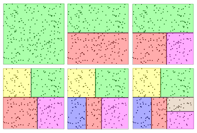

# LFAC - Low-Fidelity Audio Codec

Copyright 2021 Jari Komppa, http://iki.fi/sol
Licensed under Unlicense.

Not to be confused with FLAC.

## What is this?

Do you have a 8 bit micro and want to fit some digital audio in it?

Are you working on a toy and hate parents *so* much that you want to have even worse audio quality, and maybe save a few pennies?

Are you looking for audio compression for 8 bit PCM samples?

If you answered yes, look no further! LFAC promises pretty good compression ratios with unsurpassed audio quality*!

*) as in, worse than you can find elsewhere.

## Honestly though...

I was looking for some way to have really cheap audio compression for 8 bit PCM samples. The best I could find were (A)DPCM compression, implementations of which really targets 16 bit samples or higher, and the compression ratio isn't really great.

Also, decompression of ADPCM isn't trivial on a 8 bit CPU.

## License

LFAC, its source code and technology is licensed under Unlicense, meaning that it's practically public domain.

The encoder includes third party libraries for sample format processing and resampling, and those libraries come with their own licenses.

But really, if you do use this for anything, (especially that hardware use case), do let me know.

If you get into trouble, you're on your own, though.

## Operation principle

LFAC works by defining "grains" of audio to represent the original audio. (As in "granular synthesis", but with worse results). Since everything here is 8 bit, 256 grains are defined. The compressed format contains dictionary of grains and a list of indices to the dictionary. Thus, the compression ratio depends on the size of the grains and the size of the source data.

For slightly better quality, especially if the source material is not uniform, a window can be defined after which new grains are defined - which practically means compressing every N samples separately.

The compression ratio can be calculated as:

    outsize = (grainsize * 256) + (inputsize / grainsize)

This means that for 64k samples and grain size of 4 samples, the compression ratio becomes:

    outsize = 4 * 256 + 65536 / 4 = 17408

.. or 26.5625%. Increase the grain size or number of samples and the compression improves, but audio quality naturally also goes down.

|source|gs = 2|gs = 4|gs = 8|gs = 16|
|-:|-:|-:|-:|-:|
|16384|8704|5120|4096|5120
|32768|16896|9216|6144|6144
|65536|33280|17408|10240|8192
|131072|66048|33792|18432|12288
|262144|131584|66560|34816|20480
|524288|262656|132096|67584|36864
|1048576|524800|263168|133120|69632

As an extreme example, compressing an 1MB source with 16 sample grains compresses down to 6.64% (or 68kB). The result will sound rather horrible, but assuming the original sample rate to be 8000Hz, the size is equivalent to resampling the data down to 531Hz.

Decompression becomes trivial; simply look up the grains from the dictionary based on the indices in the compressed data. Since everything is 8 bit, this can be done on slow 8 bit CPUs like the Zilog z80. Don't ask me how the sample is actually planed on a z80, though.

## Finding the grains

To find the most promising grains, we define the audio as N-dimensional space where N is the number of samples in a grain. Then we start subdividing the space. Consider this 2d example:

After defining our space, we find the dimension by which we want to split the space, decide on some point and split it into two subspaces (by Y axis in this case).

Next, we go through all our subspaces to find the subspace and dimension by which we want to split the subspace. In this case we split the red subspace by the X dimension.

This process is continued until we reach the desired number of subspaces, i.e. the number of grains we wish to generate.

Do note that the splits may occur by any dimension depending on the splitting rules and the input data. So it's possible that we get data where we only ever want to split by the X axis, for example.

After the subspaces are defined, we average the values for each subspace to get our grains. The result works surprisingly well.

And by surprisingly well, I mean I was totally surprised the result was somewhat recognizable and not just random noise.

To improve the quality, it's easy to see that since we split the subspaces with linear cuts, the grains in the "corners" of our subspaces may actually be closer to another subspace's center. Moving them to the closest subspace actually does improve the audio quality audibly.

This changes the average grain position for each dictionary index, so we recalculate the average. This in turn means that the closest average grain may change, so we reiterate the process until the system stabilizes or we reach a maximum number of iterations.

Another trick is to rotate the samples in a grain so that the smallest sample always comes first. This reduces the average error, but also totally wrecks the audio quality, so it's a great idea, it just doesn't work.

## File format

LFAC files have the extension .sad, and have the following format (all over 1 byte values are little endian, x86 style):

|Offset|Size|Description|
|-:|-:|:-|
|0|4|Tag "LFAC"|
|4|4|Version, currently 0|
|8|4|Sample rate, in Hz|
|12|4|Number of channels, 1 = mono|
|16|4|Dimensions, or bytes per grain|
|20|4|Window size in number of indices, or 0 for infinite|
|24|4|Uncompressed data size in bytes|
|28|4|Reserved|
|32|256*N|Dictionary, N is number of bytes per grain|
|*|*|Indices, up to "window" bytes
|*|*|Dictionary for second window
|*|*|Indices for second window
|||etc|

